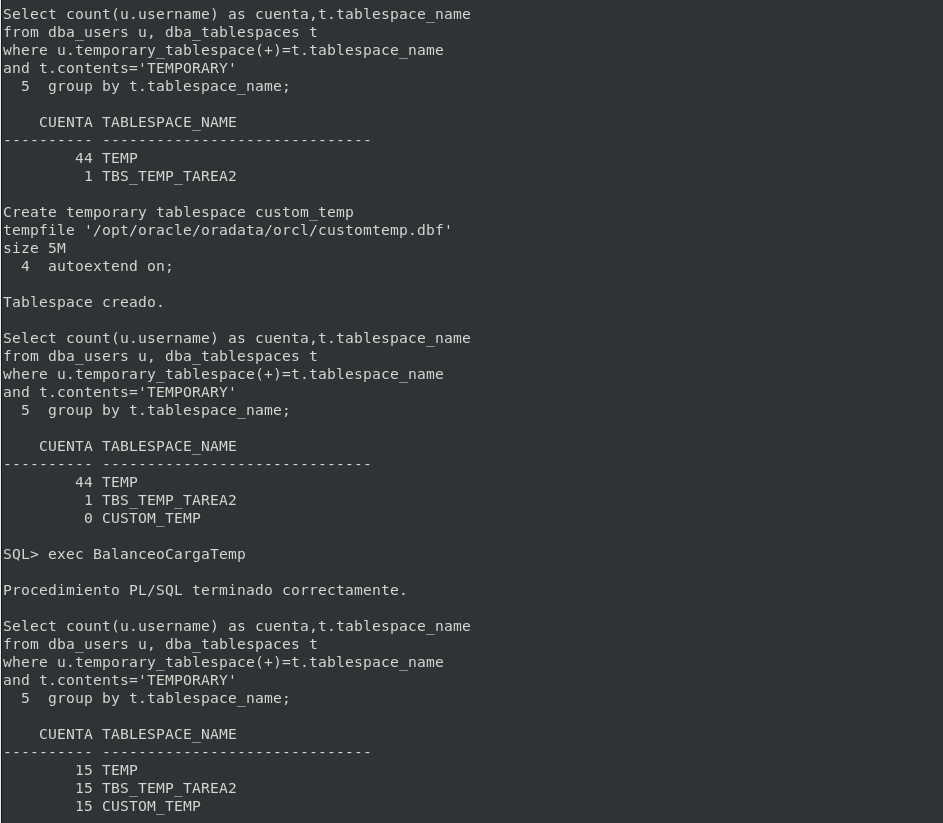
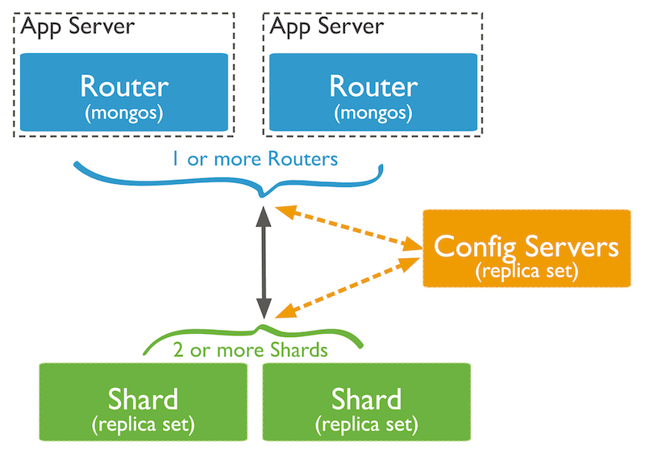

# Parte grupal

## ORACLE

## Tarea 1 
#### Cread un índice para la tabla EMP de SCOTT que agilice las consultas por nombre de empleado en un tablespace creado específicamente para índices. ¿Dónde deberiáis ubicar el fichero de datos asociado? ¿Cómo se os ocurre que podriáis probar si el índice resulta de utilidad?

Creamos el tablespace `Tablespace_Index`, que tendrá la ubicación por defecto de todos los tablespace, además le indicamos que el tamaño sea de 5MB y que sea autoextensible.

###### Creamos el tablespace
```sql
CREATE TABLESPACE Tablespace_Index
DATAFILE '/opt/oracle/oradata/orcl/index.dbf'
SIZE 5M
AUTOEXTEND on;
```

Ahora creamos un índice que indique a los nombres de los empleados y que se guarde en el tablespace creado anteriormente.

###### Creamos y asignamos el índice
```sql
CREATE INDEX EMP_ENAME ON SCOTT.EMP(ENAME)
TABLESPACE Tablespace_Index;
```

El fichero de datos asociado se tendría que ubicar en el directorio `/opt/oracle/oradata/orcl`, ya que este es la ruta por defecto de los **datafiles**.

Para comprobar si el índice resulta de utilidad, podemos realizar una consulta de la columna `ename` de la tabla `emp` y mostrar el tiempo que tarda en resolver la consulta con el parámetro `set timing on`; luego realizar la misma consulta pero con el índice definido.

###### Antes de crear el índice
```sql
SELECT ENAME FROM EMP;

ENAME
----------
CLARK
KING
MILLER
SMITH
JONES
SCOTT
ADAMS
FORD
ALLEN
WARD
MARTIN
BLAKE
TURNER
JAMES

14 filas seleccionadas.

Transcurrido: 00:00:00.01
```

###### Después de crear el índice
```sql
SELECT ENAME FROM EMP;

ENAME
----------
CLARK
KING
MILLER
SMITH
JONES
SCOTT
ADAMS
FORD
ALLEN
WARD
MARTIN
BLAKE
TURNER
JAMES

14 filas seleccionadas.

Transcurrido: 00:00:00.00
```

Como podemos apreciar, el tiempo es menor en la segunda consulta pero no es una gran diferencia ya que los registros que tiene dicha tabla no son abundantes para que la consulta muestre un rendimiento considerable con el índice respecto a sín el.


## Tarea 2 
#### Realizad una consulta al diccionario de datos que muestre qué índices existen para objetos pertenecientes al esquema de SCOTT y sobre qué columnas están definidos. Averiguad en qué fichero o ficheros de datos se encuentran las extensiones de sus segmentos correspondientes.

Vamos a realizar una consulta para mostrar los índices asociados a los objetos del usuario Scott, ademas de mostrar las columnas y los datafiles correspondiente.

Para realizar esta consulta necesitamos utilizar las siguientes vistas:

|Vistas del diccionario de datos| Descripción
|:-----------------------------:|:--------------------------------
|DBA_IND_COLUMNS                |Vista de las **columnas** que comprenden **índices**, además de su **tabla** correspondiente.
|DBA_EXTENTS                    |Vista de las extensiones que comprenden todos los segmentos de la base de datos. 
|DBA_DATA_FILES                 |Vista sobre los **datafile** de la base de datos.

###### Realizamos la consulta
```sql
SELECT a.TABLE_NAME, a.INDEX_NAME, a.COLUMN_NAME, c.FILE_NAME
FROM DBA_IND_COLUMNS a, DBA_EXTENTS b, DBA_DATA_FILES c
WHERE a.TABLE_NAME = b.SEGMENT_NAME
AND b.FILE_ID = c.FILE_ID
AND a.TABLE_OWNER='SCOTT';
```

###### Nos devuelve lo siguiente
```sql
TABLE_NAME	 INDEX_NAME   COLUMN_NAM     FILE_NAME
------------ ------------ -------------  ----------------------------------------
DEPT		 PK_DEPT	  DEPTNO         /opt/oracle/oradata/orcl/users01.dbf
EMP		     PK_EMP	      EMPNO          /opt/oracle/oradata/orcl/users01.dbf
EMP		     EMP_ENAME	  ENAME          /opt/oracle/oradata/orcl/users01.dbf
```

Podemos apreciar que además de mostrar los índices **UNIQUE** de las dos tablas de Scott, nos muestra el índice creado en la tarea 1 `EMP_ENAME`.

## Tarea 3 
#### Cread una secuencia para rellenar el campo deptno de la tabla dept de forma coherente con los datos ya existentes. Insertad al menos dos registros haciendo uso de la secuencia.

Vamos a crear la secuencia que rellenará el campo `deptno` de la tabla `dept`, que empezará por 50 (ya que el último registro es 40), y incrementará su número 10 veces, ya que es como funciona `deptno`, de 10 en 10.
Además podemos añadirle el mínimo y el máximo. Nosotros vamos a indicarle que sea mínimo 10 y máximo 100.

Por defecto esta la opción de `NONCYCLE`, por lo que no tenemos que indicar nada. esta opción es para que no vuelva al valor mínimo una vez que llegue al máximo.

###### Creamos la secuencia
```sql
CREATE SEQUENCE DEPTNOSEC
  START WITH 50
  INCREMENT BY 10
  MAXVALUE 100
  MINVALUE 10;
```

Los valores de la secuencia podrá ser currval, que sirve para poder repetir el valor ya dado en la secuencia, y `nextval` será el siguiente valor en la lista.

Nosotros vamos a utilizar `nextval` para que la secuencia continue sumando 10.

###### Insertamos registros nuevos
```sql
INSERT INTO DEPT VALUES
  (deptnosec.nextval,'DEVOPS','SEVILLA');

INSERT INTO DEPT VALUES
  (deptnosec.nextval,'DEVELOPER','CADIZ');
```

###### Comprobamos que la secuencia ha funcionado
```sql
SELECT * FROM DEPT;

DEPTNO  DNAME          LOC
------- -------------- -------------
10      ACCOUNTING     NEW YORK
20      RESEARCH       DALLAS
30      SALES          CHICAGO
40      OPERATIONS     BOSTON
50      DEVOPS         SEVILLA
60      DEVELOPER      CADIZ

6 filas seleccionadas.
```

Como podemos ver en la comprobación, la secuencia ha funcionado correctamente, pasando de 40 a 50 y luego 60 y así progresivamente hasta el máximo que es 100.

## Tarea 4 
#### Queremos limpiar nuestro fichero tnsnames.ora. Averiguad cuales de sus entradas se están usando en algún enlace de la base de datos.

El fichero tsnames son las conexiones a las que nuestro servidor de Oracle puede acceder, hemos observado que hay una conexión activa.

###### Comprobamos las conexiones activas
```sql
SELECT * FROM v$dblink;

DB_LINK         OWNER_ID   LOG HET PROTOC OPENCURSORS  IN  UPD COMMIT_POINT_STRENGTH CON_ID
--------------- ---------- --- --- ------ ------------ --- --- --------------------- ----------
GRUPAL           0         YES NO  UNKN    0           YES NO   0                     1
```

Hay creados todos estos `db_links`, pero solo está activo uno, por lo que los demás podriamos descartarlos y no reocuparnos de ellos si tenemos que limpiar nuestro fichero `tsnames.ora`.

###### Comprobamos todos los que existen
```sql
SELECT * FROM DBA_DB_LINKS;

OWNER      DB_LINK                USERNAME           HOST             CREATED
---------- ---------------------- ------------------ ---------------- ----------
SYS        FERNANDO_DELEGADO      LUIS               orcluis          28/01/20
SYS        FERNANDO_LINKLUIS3     LUIS               orcluis          13/01/20
SYS        FERNANDO_LINKLUIS5     LUIS               orcluis          13/12/19
SYS        FERNANDO_LINKLUIS2     LUIS               orcl2            13/12/19
SYS        FERNANDO_LINKLUIS      LUIS               orcl             13/12/19
SYS        FERNANDO_LINKORCL      PALOMA             orcl             12/12/19
SYS        FERNANDO_LINK          PALOMA             oraDB            12/12/19
PUBLIC     GRUPAL                 delegadofer        PSQLU            28/01/20
PUBLIC     FERNANDODELEGADOLUIS   clienteconexion    PSQLU            28/01/20
PUBLIC     FERNANDODELEGADO       clienteconexion    PSQLU            28/01/20
PUBLIC     FERNANDOPOSTGRESLUIS   clienteconexion    PSQLU            13/12/19

11 filas seleccionadas.
```

## Tarea 5 
#### Meted las tablas EMP y DEPT de SCOTT en un cluster.

Vamos a crear un cluster de las tablas `emp` y `dept`. Un cluster es un objeto de esquema que contiene datos de una o más tablas, estas deben de tener una o más columnas en común; esto hace que al realizar consultas donde utilicemos las dos tablas se realizará de forma más rápida. 

Crearemos un tablespace, `Cluster_empdept`, para usarlo en el cluster.

###### Creamos el tablespace
```sql
CREATE TABLESPACE Cluster_empdept
DATAFILE '/opt/oracle/oradata/orcl/empdept.dbf'
SIZE 5M
AUTOEXTEND ON;
```

Ahora vamos a crear el cluster `emp_dept` que contiene deptno, que es la columna común y le indicamos el tablespace creado anteriormente.

###### Creamos el cluster
```sql
CREATE CLUSTER emp_dept
(deptno NUMBER(2))
Tablespace Cluster_empdept;
```

Tenemos que crear un índice, que lo usará el cluster para identificar la columna común.

###### Creamos el índice
```sql
CREATE INDEX index_empdept ON CLUSTER emp_dept;
```

Para meter las tablas en el cluster creado tenemos que realizar los siguientes pasos:

1. Creamos un backup de las tablas originales.
2. Insertamos los datos en las tablas backup.
3. Eliminar las tablas originales.
4. Crear las tablas en el cluster.
5. Insertar los datos en las tablas del cluster.
6. Eliminar las tablas backups.
   
Creamos un backup de las tablas para después poder crear las tablas sin problema de datos, ya que con las tablas originales no se puede realizar esta modificación.

###### 1. Creamos los backups
```sql
CREATE TABLE SCOTT.DEPT_BAK
(
 DEPTNO NUMBER(2),
 DNAME VARCHAR2(14),
 LOC VARCHAR2(13),
 CONSTRAINT PK_DEPT_BAK PRIMARY KEY (DEPTNO)
);

CREATE TABLE SCOTT.EMP_BAK
(
 EMPNO NUMBER(4),
 ENAME VARCHAR2(10),
 JOB VARCHAR2(9),
 MGR NUMBER(4),
 HIREDATE DATE,
 SAL NUMBER(7, 2),
 COMM NUMBER(7, 2),
 DEPTNO NUMBER(2),
 CONSTRAINT FK_DEPTNO_BAK FOREIGN KEY (DEPTNO) REFERENCES SCOTT.DEPT_BAK (DEPTNO),
 CONSTRAINT PK_EMP_BAK PRIMARY KEY (EMPNO)
);
```

###### 2. Insertamos los datos en la tablas backups 
```sql
INSERT INTO SCOTT.EMP_BAK
SELECT * FROM SCOTT.EMP;

INSERT INTO SCOTT.DEPT_BAK
SELECT * FROM SCOTT.DEPT;
```

###### 3. Borramos las originales
```sql
DROP TABLE SCOTT.EMP;
DROP TABLE SCOTT.DEPT;
```

###### 4. Y creamos las tablas en el cluster 
```sql
CREATE TABLE SCOTT.DEPT
(
 DEPTNO NUMBER(2),
 DNAME VARCHAR2(14),
 LOC VARCHAR2(13),
 CONSTRAINT PK_DEPT PRIMARY KEY (DEPTNO)
)
CLUSTER EMP_DEPT (DEPTNO);

CREATE TABLE SCOTT.EMP
(
 EMPNO NUMBER(4),
 ENAME VARCHAR2(10),
 JOB VARCHAR2(9),
 MGR NUMBER(4),
 HIREDATE DATE,
 SAL NUMBER(7, 2),
 COMM NUMBER(7, 2),
 DEPTNO NUMBER(2),
 CONSTRAINT FK_DEPTNO FOREIGN KEY (DEPTNO) REFERENCES SCOTT.DEPT (DEPTNO),
 CONSTRAINT PK_EMP PRIMARY KEY (EMPNO)
)
CLUSTER EMP_DEPT (DEPTNO);
```

###### 5. Y volvemos a insertar los datos
```sql
insert into SCOTT.EMP
SELECT * from SCOTT.EMP_BAK;

insert into SCOTT.DEPT
SELECT * FROM SCOTT.DEPT_BAK;
```

###### 6. Borramos las tablas backups
```sql
DROP TABLE SCOTT.EMP_BAK;
DROP TABLE SCOTT.DEPT_BAK;
```

###### Observamos que el cluster está en el diccionario de datos.
```sql
SQL> select cluster_name from dba_clusters where owner = 'SCOTT';

CLUSTER_NAME
-------------
EMP_DEPT
```

## Tarea 6 
#### Realizad un procedimiento llamado BalanceoCargaTemp que balancee la carga de usuarios entre los tablespaces temporales existentes. Para ello averiguará cuántos existen y asignará los usuarios entre ellos de forma equilibrada. Si es necesario para comprobar su funcionamiento, crea tablespaces temporales nuevos.

Vamos a realizar un balanceo de carga de los tablespaces temporales, para que se dividan los usuarios por igual en los distintios tablespaces temporales.

###### Consulta para ver los usuarios que hay en cada tablespace temporal
```sql
SELECT COUNT(U.USERNAME) as Cuenta, t.TABLESPACE_NAME
FROM DBA_USERS u, DBA_TABLESPACES t
WHERE u.TEMPORARY_TABLESPACE(+)=t.TABLESPACE_NAME
AND t.CONTENTS='TEMPORARY'
GROUP by t.TABLESPACE_NAME;
```

Para crear el procedimiento de balanceo de carga tenenemos que tener en cuenta el tablespace con mayor número de usuarios y el menor, y balancear la carga del mayor y asignarle los usuarios al menor.

###### Creamos el procedimiento de balanceo de carga
```sql
-- Procedimiento que realiza las condiciones necesarias para hacer el balanceo de carga.
CREATE OR REPLACE PROCEDURE BalanceoCargaTemp
IS
    v_numusuarios NUMBER;
    v_menor NUMBER;
    v_mayor NUMBER;
    v_menorts VARCHAR2(20);
    v_mayorts VARCHAR2(20);
BEGIN
    ConseguirMinTablespace(v_menorts,v_menor);
    ConseguirMaxTablespace(v_mayorts,v_mayor);
    while v_mayor != v_menor or v_mayor = (v_menor + 1) loop
        RealizarBalance(v_mayorts,v_menorts);
        ConseguirMinTablespace(v_menorts,v_menor);
        ConseguirMaxTablespace(v_mayorts,v_mayor);
    end loop;
END;
/

-- Procedimiento que realiza el cambio de un usuario del tablespace con mayor número de usuario al menor
CREATE OR REPLACE PROCEDURE RealizarBalance(p_tablespacemayor VARCHAR2,
                                            p_tablespacemenor VARCHAR2)
IS
    v_user VARCHAR2(50);
BEGIN
    select username into v_user
    from dba_users
    where temporary_tablespace = p_tablespacemayor
    and username != 'XS$NULL'
    fetch first row only;
    execute immediate 'alter user '||v_user||' temporary tablespace '||p_tablespacemenor;
END;
/

-- Procedimiento que devulve el nombre del tablespace y la cantidad de usuarios menor. 
CREATE OR REPLACE PROCEDURE ConseguirMinTablespace(p_tablespace IN OUT VARCHAR2,
                                                   p_cuenta IN OUT NUMBER)
IS
BEGIN
    select count(u.username) as cuenta, t.tablespace_name INTO p_cuenta, p_tablespace
    from dba_users u, dba_tablespaces t
    where u.temporary_tablespace(+) = t.tablespace_name
    and t.contents = 'TEMPORARY'
    group by t.tablespace_name
    order by cuenta asc
    fetch first row only;
END;
/

-- Procedimiento que devulve el nombre del tablespace y la cantidad de usuarios mayor.
CREATE OR REPLACE PROCEDURE ConseguirMaxTablespace(p_tablespace IN OUT VARCHAR2,
                                                   p_cuenta IN OUT NUMBER)
IS
BEGIN
    select count(u.username) as cuenta, t.tablespace_name INTO p_cuenta, p_tablespace
    from dba_users u, dba_tablespaces t
    where u.temporary_tablespace(+) = t.tablespace_name
    and t.contents = 'TEMPORARY'
    group by t.tablespace_name
    order by cuenta desc
    fetch first row only;
END;
/
```



## Tarea 7 
#### Realizad un pequeño artículo o una entrada para un blog técnico explicando las limitaciones quepresentan MySQL y Postgres para gestionar el almacenamiento de los datos respecto a ORACLE, si esque presentan alguna.

### PostgreSQL

El **Storage Manager** es quien lleva a cabo la administración de almacenamiento de datos. PostgreSQL posee un solo **Storage Manager**, y este esta compuesto por varios módulos que proveen administración de las transacciones y acceso a los objetos de la base de datos. Estos tienen principalmente 3 objetivos:

- Manejar transacciones sin necesidad de escribir código complejo de recuperación en caso de caídas.
- Mantener versiones históricas de la data bajo el concepto de “graba una vez, lee muchas veces”.
- Tomar las ventajas que ofrece el hardware especializado como multiprocesadores, memoria no volátil, etc.

Los nombres de estos módulos son: Transaction System, Relational Storage, Time Management, Record Access, Concurrency Control y Timestamp Management.

Otras características del almacenamiento en PostgreSQL:

- En PostgreSQL no es posible almacenar archivos muy grandes directamente. Para superar esta limitación, se comprimen y/o se dividen en múltiples filas. Esta técnica se conoce como **TOAST**.
- El tamaño mínimo, y por defecto, de una página es de 8k y máximo 32k. No se permiten tuplas más grandes que las páginas.
- Cada relación en una base de datos tiene un **Visibility Map**, que se encarga de realizar un seguimiento de las mismas.
- El **Free Space Map** se encarga de realizar un seguimiento del espacio disponible en una relación.

Limitaciones respecto a ORACLE:

- Antes de la versión 9.0 no soportaba tablespaces para definir dónde almacenar la base de datos, el esquema, los índices, etc.
- No presenta clausulas de almacenamiento de datos, lo que impide asignar cuotas de almacenamiento.
- Las transacciones se abortan completamente en caso de fallo durante su ejecución.
- Tamaño máximo de una tabla: 32 TB.
- Tamaño máximo de una fila: 400 GB
- Tamaño máximo de un campo: 1 GB

### MySQL

Las principales caracteristicas del almacenamiento de los datos en MySql son los motores de almacenamientos.

Los motor de almacenamiento son los encargados de controlar y recuperar los datos de un tabla. Los mas relevantes son:

|Motor de almacenamiento| Descripción
|:------:|:----------
|MyISAM| Es el motor de almacenamiento que se utiliza por defecto. La pricipal caracteristica de este motor es la gran velocidad que obtiene en las consultas, ya que no tiene que hacer comprobaciones de la integridad referencial.
|InnoDB| este motor empieza a sustituir a MyISAM. Soporta transacciones y bloqueos de registro e integridad referencial, además ofrece una fiabilidad y consistencia muy superior a MyISAM.
|NBD| Es el motor usado por Mysql Cluster para implementar tablas que se particionan en varias máquinas.

Limitaciones respecto a ORACLE:

- En MySQL el número máximo de índices por cada tabla es 64, en cambio en Oracle es ilimitado.
- Las columnas usadas en índices son de 16 columnas como máximo y en Oracle es el doble.
- El número máximo de registros es de 50 millones y 450 mil millones en Oracle.
- Tamaño máximo de índice: 1 GB.

En Mysql como en Oracle podemos crear y asignar un tablespace, además de el tamaño inicial de una tabla, la característica de que pueda extenderse automáticamente en el caso que hiciera falta y asignar un cierto tamaño a la extensión. La sintaxis para crear un tablespace es la que veremos a continuación:

```sql
CREATE TABLESPACE tablespace_name

  InnoDB and NDB:
    ADD DATAFILE 'file_name'

  InnoDB only:
    [FILE_BLOCK_SIZE = value]

  NDB only:
    USE LOGFILE GROUP logfile_group
    [EXTENT_SIZE [=] extent_size]
    [INITIAL_SIZE [=] initial_size]
    [AUTOEXTEND_SIZE [=] autoextend_size]
    [MAX_SIZE [=] max_size]
    [NODEGROUP [=] nodegroup_id]
    [WAIT]
    [COMMENT [=] 'string']

  InnoDB and NDB:
    [ENGINE [=] engine_name]
```

La principal desventaja de Mysql respecto a Oracle es que en INNODB no podemos asignar una cuota a cada usuario en cualquier tablespace. Un tablespace creado en INNODB es considerado un tablespace general, el cual es compartido y es similar al tablespace del sistema.

## Tarea 8
#### Explicad en qué consiste el sharding en MongoDB.

Sharding consiste en repartir los conjuntos de datos a los distintos clusters, que denominamos shars, de tal forma que exista una distribución de los datos equitativamente a lo largo de los distintos nodos. Por lo tanto el sharding nos permite mejorar el rendimiento de nuestro sistema ya que al distribuir la carga entre distintas máquinas no existe sobrecarga de un nodo.

Elementos de la arquitectura:

* **Mongos**: Son las instancias que hacen de interfaz entre los shards donde se encuentran los datos.

* **Shards**: Son los clusters en donde se encuentra los documentos de nuestras colecciones. Cada cluster contiene un subconjunto del dataset. La información dentro de un cluster se agrupa en torno a agrupaciones lógicas denominados chunks.

* **Config Server**: Son instancias mongod que contienen información asociados al dataset. En concreto indican donde se encuentran los documentos en base a shards o chunks. Puede desplegarse en forma de réplica.

Para que la información se distribuya entre los clusters:

* **Split Chunks**: Es la subdivisión de chunks y se produce cuando se sobrepasa el tamaño, ya que hay un límite de documentos.
* **Migration Chunks**: La migración es el procedimiento de distribuir un chunk de un shard a otro. Este proceso lo realiza un proceso llamado balancer que se encuentra en el nodo primario del Config Server. Cuando dicho proceso compara entre el número de chunks del shard que mas tiene con el que tiene menos, se inicia la migración.

El sharding trabaja a nivel de colección, con esto podemos decidir que colecciones queremos distribuir. Las colecciones que no hayamos distribuido se encontrarán en el shard primario.



## Tarea 9
#### Resolved el siguiente caso práctico en ORACLE:

En nuestra empresa existen tres departamentos: Informática, Ventas y Producción. En Informática trabajan tres personas: Pepe, Juan y Clara. En Ventas trabajan Ana y Eva y en Producción Jaime y Lidia.

### Apartado (a)

* Pepe es el administrador de la base de datos.
* Juan y Clara son los programadores de la base de datos, que trabajan tanto en la aplicación que usa el departamento de Ventas como en la usada por el departamento de Producción.
* Ana y Eva tienen permisos para insertar, modificar y borrar registros en las tablas de la aplicación de Ventas que tienes que crear, y se llaman Productos y Ventas, siendo propiedad de Ana.
* Jaime y Lidia pueden leer la información de esas tablas pero no pueden modificar la información.
Crea los usuarios y dale los roles y permisos que creas conveniente.  

---------------------------------------------------

Creamos al usuario Pepe, que va a ser el Adminsitrador, por eso le asignamos el rol DBA. El rol DBA tiene el privilegio de ver y manejar todos los datos de la BD.
```sql
create user Pepe identified by admin;
grant DBA to Pepe;
```

Vamos a crear al usuario Juan y Clara, que van a ser los programadores.
```sql
create user Juan identified by juan;
create user Clara identified by clara;
```

Ahora vamos a crear un rol para los programadores, ya que van a desarrolar aplicaciones en la base de datos, para que puedan desarrolar aplicaciones deben de poder crear, modificar y elimnar los objetos de ellas. Los permisos que vamos a asignar a los programadores son:

|Privilegio         |Descripción
|:------------------|:---------------------
|CREATE TABLE       |
|CREATE VIEW        |
|CREATE PROCEDURE   |
|CREATE TRIGGER     |
|CREATE SEQUENCE    |
|CREATE SYNONYM     |

```sql
create role Programadores;
grant create any table, create any index, create view, create procedure, create trigger, create sequence, create synonym to Programadores;
grant connect to Programadores;
grant Programadores to Juan;
grant Programadores to Clara;
```

```sql
create user Ana identified by ana;
create user Eva identified by eva;
```

```sql
create table ANA.PRODUCTOS
(
Codigo VARCHAR2(10),
Nombre VARCHAR2(20),
Descripcion VARCHAR2(50),
Precio NUMBER,
constraint pk_codigop PRIMARY KEY(Codigo)
);

create table ANA.VENTAS
(
Codigo VARCHAR2(10),
CodigoProducto VARCHAR2(10),
CantidadVendida NUMBER,
Fecha DATE,
Lugar VARCHAR2(20),
constraint pk_codigov PRIMARY KEY(Codigo),
constraint fk_codigoprod FOREIGN KEY(CodigoProducto) REFERENCES ANA.PRODUCTOS
);
```

```sql
CREATE ROLE VENTAS;
grant insert, delete, update on ANA.productos to Ventas;
grant insert, delete, update on ANA.ventas to Ventas;
grant Ventas to Ana;
grant Ventas to Eva;

```

```sql
insert into ANA.Productos
values('123123123L','Pollo','Pollo envasado','5');
insert into ANA.Productos
values('124124124M','Jamon','Jamon al vacio','10');
insert into ANA.Productos
values('125125125N','Chorizo','Chorizo iberico','8');

insert into ANA.Ventas
values('9768758901','123123123L','250','23-09-2019','Sevilla');
insert into ANA.Ventas
values('5836249231','124124124M','300','14-11-2019','Cordoba');
insert into ANA.Ventas
values('9843626321','125125125N','150','20-12-2019','Huelva');
```


```sql
create user Jaime identified by jaime;
create user Lidia identified by lidia;
```


Vamos a utilizar el permiso de `GRANT READ`, porque el privilegio de `GRANT SELECT`, bloquea los registros que devuelve el `SELECT` para que no puedan ser modificados, los registros que se le aplique el `for update`, por otras secciones.


```sql
create role Produccion;
grant connect to Produccion;
grant read on ANA.PRODUCTOS to Produccion;
grant read on ANA.VENTAS to Produccion;
grant Produccion to Jaime;
grant Produccion to Lidia;
```

### Apartado (b)

Los espacios de tablas son System, Producción (ficheros prod1.dbf y prod2.dbf) y Ventas (fichero vent.dbf).

* Los programadores del departamento de Informática pueden crear objetos en cualquier tablespace de la base de datos, excepto en System.
* Los demás usuarios solo podrán crear objetos en su tablespace correspondiente teniendo un límite de espacio de 30 M los del departamento de Ventas y 100K los del de Producción.
* Pepe tiene cuota ilimitada en todos los espacios, aunque el suyo por defecto es System.

-----------------------------------------------------

Si un tablespace está formado por 2 datafiles y tenemos una tabla en ese tablespace, a medida que vamos insertando filas éstas se almacenarán en cualquiera de los dos datafiles indistintamente, es decir, unas pueden estar en un datafile y otras en otro. 

Tenemos que tener también en cuenta que el espacio de tabla `SYSTEM` ya existe.

###### Crearemos ambos tablespaces para poder poner las cuotas a ambos usuarios
```sql
CREATE TABLESPACE Produccion
DATAFILE '/opt/oracle/oradata/orcl/prod1.dbf' SIZE 50M,
'/opt/oracle/oradata/orcl/prod2.dbf' SIZE 50M
AUTOEXTEND OFF;

CREATE TABLESPACE Ventas
DATAFILE '/opt/oracle/oradata/orcl/vent.dbf' SIZE 100M
AUTOEXTEND OFF;
```

Añadiremos las cuotas a los usuarios, en este caso Ana y Eva tendran el límite de 30M y Lidia y Jaime de 100k

###### Añadimos las cuotas
```sql
ALTER USER ANA DEFAULT TABLESPACE VENTAS QUOTA 30M ON VENTAS;
ALTER USER EVA DEFAULT TABLESPACE VENTAS QUOTA 30M ON VENTAS;
ALTER USER LIDIA DEFAULT TABLESPACE PRODUCCION QUOTA 100K ON PRODUCCION;
ALTER USER JAIME DEFAULT TABLESPACE PRODUCCION QUOTA 100K ON PRODUCCION;
```

Y a pepe lo añadiremos con el tablespace system.


```sql
ALTER USER PEPE DEFAULT TABLESPACE SYSTEM;
GRANT UNLIMITED TABLESPACE TO PEPE;
```

```sql
CREATE OR REPLACE PROCEDURE DarPrivilegiosTablespaces(p_user VARCHAR2)
IS
BEGIN
	dbms_output.put_line('GRANT UNLIMITED TABLESPACE TO '||p_user||';');
	dbms_output.put_line('ALTER USER '||p_user||' QUOTA 0 ON SYSTEM'||';');
END;
/

CREATE OR REPLACE PROCEDURE ObjetosTablespaceProgramadores
IS
	cursor c_users is
	select GRANTEE
	from dba_role_privs
	where Granted_Role='PROGRAMADORES'
	and Grantee!='SYS';
BEGIN
	for v_users in c_users loop
		DarPrivilegiosTablespaces(v_users.Grantee);
	end loop;
END;
/
```

###### Comprobamos como funciona
```sql
EXEC ObjetosTablespaceProgramadores();
    GRANT UNLIMITED TABLESPACE TO JUAN;
    ALTER USER JUAN QUOTA 0 ON SYSTEM;
    GRANT UNLIMITED TABLESPACE TO CLARA;
    ALTER USER CLARA QUOTA 0 ON SYSTEM;

    Procedimiento PL/SQL terminado correctamente.
```


### Apartado (c)

Pepe quiere crear una tabla Prueba que ocupe inicialmente 256K en el tablespace Ventas.

----------------------------------------------------------

Nos conectamos al usuario Pepe y creamos la tabla con las indicaciones dadas.

```sql
CREATE TABLE Prueba( 
    Prueba VARCHAR2(2)
    )
    TABLESPACE Ventas
    STORAGE(Initial 256K);
```

### Apartado (d)

Pepe decide que los programadores tengan acceso a la tabla Prueba antes creada y puedan ceder ese derecho y el de conectarse a la base de datos a los usuarios que ellos quieran.

----------------------------------------------------------

```sql
GRANT READ ON PEPE.PRUEBA TO PROGRAMADORES with grant option;
GRANT CREATE SESSION TO PROGRAMADORES with admin option;
```

### Apartado (f)

Lidia y Jaime dejan la empresa, borra los usuarios y el espacio de tablas correspondiente, detalla los pasos necesarios para que no quede rastro del espacio de tablas.

----------------------------------------------------------

```sql
DROP USER Lidia;
DROP USER Jaime;
DROP TABLESPACE Produccion INCLUDING CONTENTS AND DATAFILES;
```