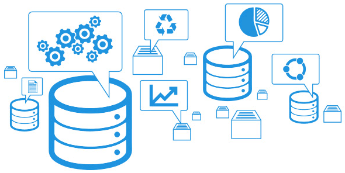

# Gestión del almacenamiento en Oracle, Postgres, MySQL y MongoDB

#### Vamos a trabajar con: 

* Creación y uso de índices 
* Claúsulas de almacenamiento 
* Gestión de espacios de tablas 
* Gestión de enlaces de bases de datos 
* Gestión de clusters y tablas 
* Creación y uso de secuencias.

### Índice

* [Alumno 1]()
  * [Oracle]()
  * [Postgres]()
  * [MySQL]()
  * [MongoDB]()
  
* [Alumno 2]()
  * [Oracle]()
  * [Postgres]()
  * [MySQL]()
  * [MongoDB]()

* [Alumno 3]()
  * [Oracle]()
  * [Postgres]()
  * [MySQL]()
  * [MongoDB]()

* [Alumno 4](https://github.com/MoralG/Gestion_del_Almacenamiento_BBDD/blob/master/AlejandroM_Individual.md#alumno-4)
  * [Oracle](https://github.com/MoralG/Gestion_del_Almacenamiento_BBDD/blob/master/AlejandroM_Individual.md#oracle)
  * [Postgres](https://github.com/MoralG/Gestion_del_Almacenamiento_BBDD/blob/master/AlejandroM_Individual.md#postgres)
  * [MySQL](https://github.com/MoralG/Gestion_del_Almacenamiento_BBDD/blob/master/AlejandroM_Individual.md#mysql)
  * [MongoDB](https://github.com/MoralG/Gestion_del_Almacenamiento_BBDD/blob/master/AlejandroM_Individual.md#mongodb)
  
* [Parte Grupal](https://github.com/MoralG/Gestion_del_Almacenamiento_BBDD/blob/master/Grupal_Almacenamiento.md#parte-grupal)
